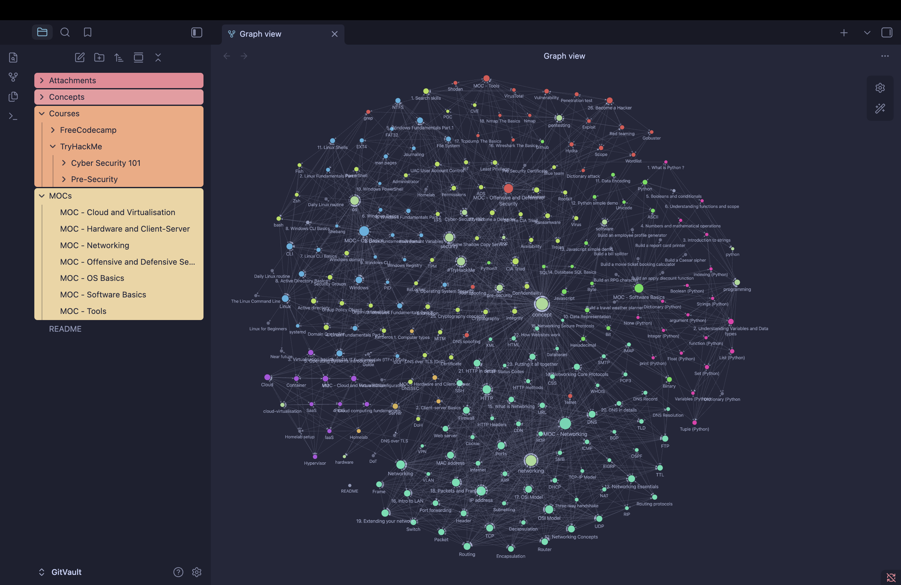
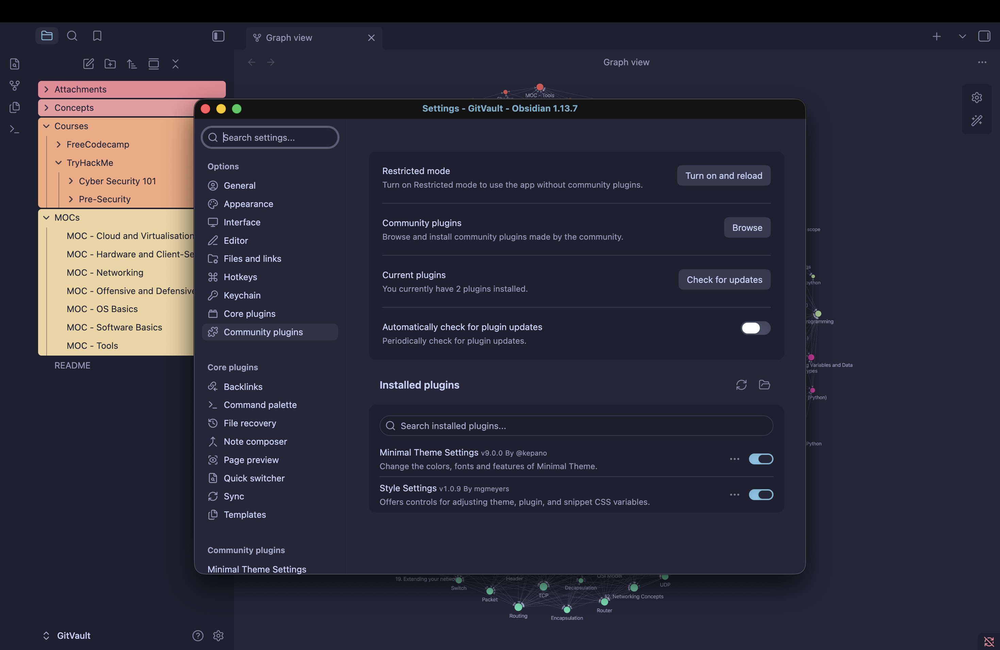
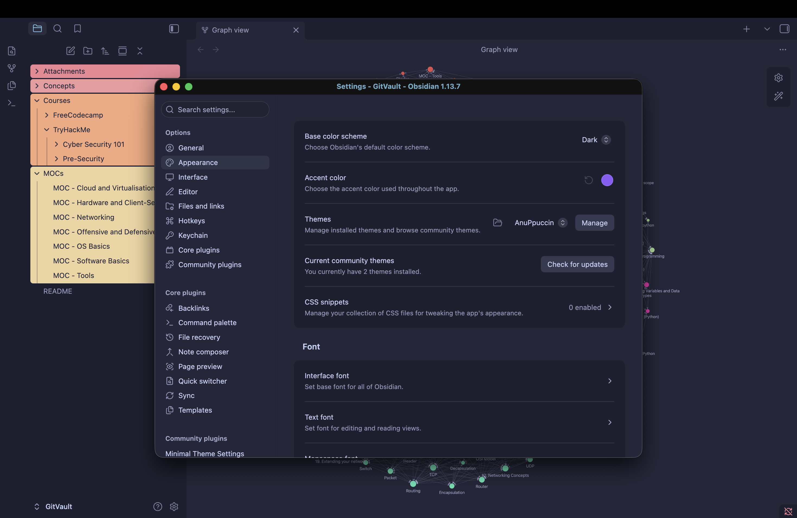

# GitOwl58 Obsidian Vault Complete CyberSecurity Beginners.

<table>
  <tr>
    <td align="center">
       
      <b>Graph Overview</b>
    </td>
    <td align="center">
       
      <b>Graph Color Groups</b>
    </td>
  </tr>
  <tr>
    <td align="center">
       
      <b>Trust the author</b>
    </td>
    <td align="center">
       
      <b>Settings</b>
    </td>
  </tr>
</table>
#Installation

	- git clone https://github.com/GitOwl58/GitVault.git
	- Open Obsidian and select "Open folder as vault"
	- Select "GitVault"
	- A pop up will ask you if you trust the author, yes.
	- Keep restricted mode turned off "See screenshots"
	- Current theme is minimal/AnuPpuccin
	- Groups are already color coded in Graph, feel free
	  to tweak it as you prefer.

# Who is this for ?

I published this repo to help any complete beginner like me to 
start learning Cyber Security basics.
		
The structure of this repo is designed to be used with Obsidian 
Vault.
It is only aimed at complete beginners, as it is reviewing basics 
and will be slowly updated, as fast as my personal life lets me.

I hope this will be able to help, even if it is just one person, 
toenjoy learning Cyber Security as much as I enjoy creating this.
