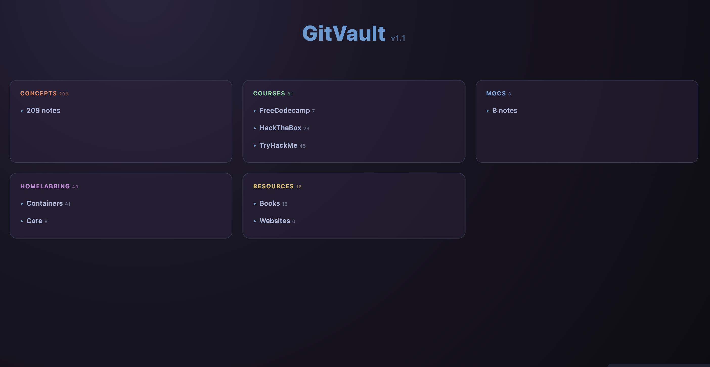

# GitOwl58 Obsidian Vault Complete CyberSecurity Beginners.

<table>
  <tr>
    <td align="center" colspan="2">
       
      <b>Dashboard</b>
    </td>
  </tr>
  <tr>
    <td align="center">
       
      <b>Graph Overview</b>
    </td>
    <td align="center">
       
      <b>Graph Color Groups</b>
    </td>
  </tr>
  <tr>
    <td align="center">
       
      <b>Trust the author</b>
    </td>
    <td align="center">
       
      <b>Settings</b>
    </td>
  </tr>
</table>
#Installation

	- git clone https://github.com/GitOwl58/GitVault.git
	- Open Obsidian and select "Open folder as vault"
	- Select "GitVault"
	- A pop up will ask you if you trust the author, yes.
	- Keep restricted mode turned off "See screenshots"
	- Current theme is minimal/AnuPpuccin
	- Groups are already color coded in Graph, feel free
	  to tweak it as you prefer.

# Who is this for ?

I published this repo to help all complete beginners like me to 
start learning Cyber Security basics, Homelabbing and Programming.

You will find here my personal notes taken from the lessons I currently follow,
I will not post flags, answers, or questions from active or retired content, certification 
exams.

AI is not used to Download, copy, index, compile any data, any web page or public/private
resource, but only to check typos once in a while as I do mispell quite often in english.
		
The structure of this repo is designed to be used with Obsidian 
Vault, but as the nature of Obsidian is tu use .md notes, it can be used with any note 
taking app at the cost of maybe not being able to use links, footnotes, etc...
It is aimed at complete beginners, as it is reviewing basics and will be slowly updated,
 as fast as my personal life allows me.

Thank you to all contributors, more knowledgeable, taking time to help, correct
this vault's content, you are greatly appreciated.

I hope this will be able to help, even if it is just one person, 
to enjoy learning Cyber Security, Homelabbing and programming as much as I enjoy creating
 this.
